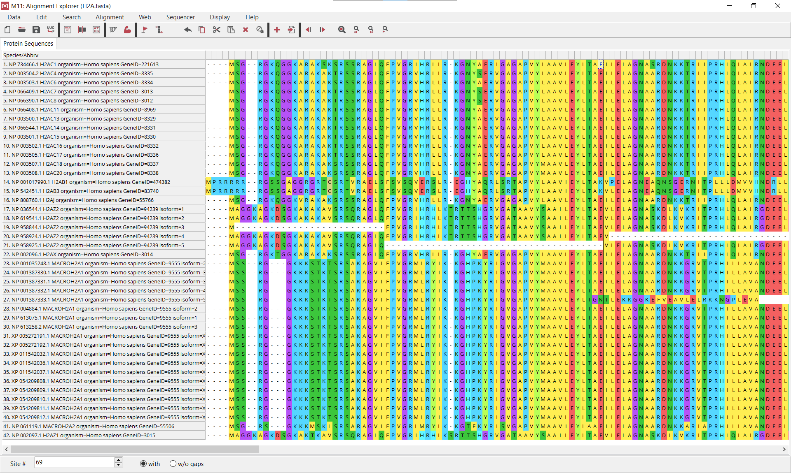
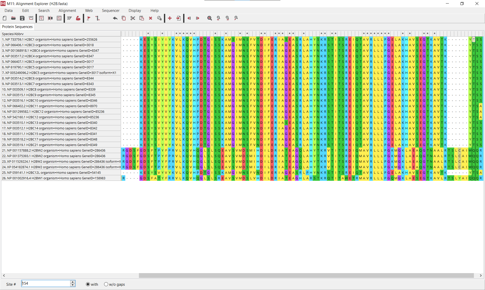
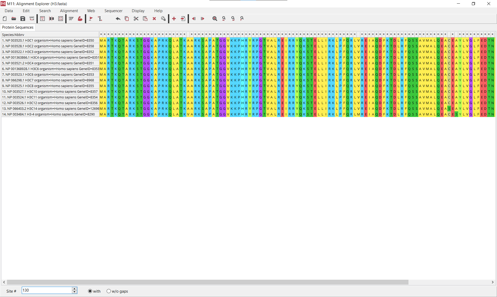
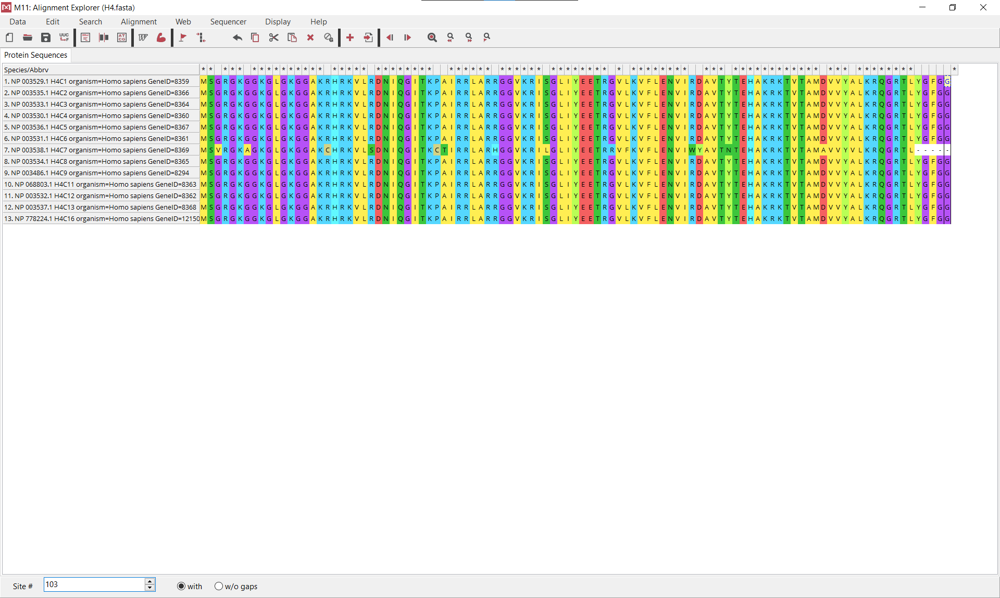
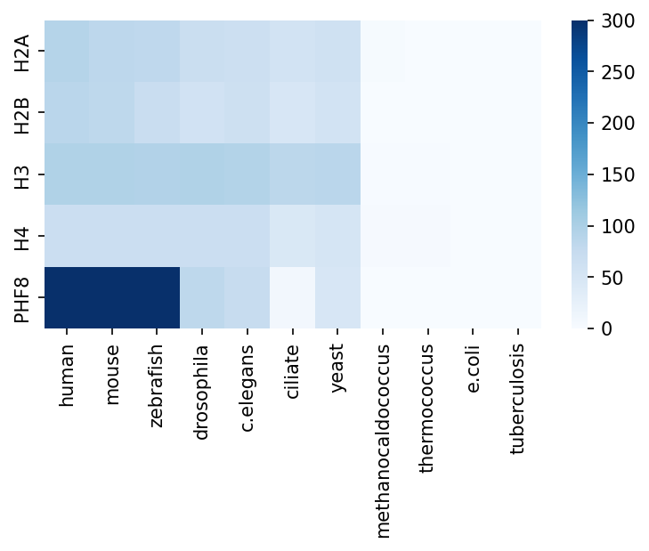

# Общее о PHF8
Эпигенетическая функция:
1) PHD finger protein 8 (PHF8) belongs to the JmJc domain-containing family of proteins that can remove methyl groups from arginine or lysine residues (…) the identified H3K4me3 readers Sgf29, TRRAP, PHF8 (…) [Vermeulen, et al., 2010] (http://doi.org/10.1016/j.cell.2010.08.020)
2) PHF8 is associated with hypomethylated rRNA genes (…) [Feng, et al., 2010] (https://doi.org/10.1038/nsmb.1778)

Входит в комплекс PHF8-TOPBP1. Экспрессируется в семенниках, яичнике, матке. Наблюдаются домены JHD, PHD_PHF8, cupin_RmlC, JmjC.

# Выравнивание
|Название | Скриншот |
|:-:|:-:|
|H2A||
|H2B||
|H3||
|H4||

### Белки в H3 и H4 почти не различаются, есть небольшой полиформизм. В других же гистонах белки отличаются силнее, но все равно не так сильно. 

# E-value (обрезка < 1e-300 и > 1)
|      |    human |    mouse |   zebrafish |   drosophila |   c.elegans |   ciliate |    yeast |   methanocaldococcus |   thermococcus |   e.coli |   tuberculosis |
|:-----|---------:|---------:|------------:|-------------:|------------:|----------:|---------:|---------------------:|---------------:|---------:|---------------:|
| H2A  | 4.94e-91 | 4.57e-84 |    1.06e-81 |     2.34e-69 |    6.53e-67 |  2.45e-57 | 8.88e-63 |             0.001    |       0.15     |      1   |          0.4   |
| H2B  | 2.85e-87 | 1.15e-83 |    1.85e-71 |     3.3e-59  |    5.28e-65 |  1.91e-49 | 3.07e-57 |             1        |       0.17     |      1   |          1     |
| H3   | 2.19e-96 | 1.54e-96 |    1.77e-95 |     9.39e-96 |    4.46e-94 |  8.41e-86 | 3.31e-87 |             0.034    |       0.057    |      0.9 |          1     |
| H4   | 1.09e-67 | 7.6e-68  |    1.13e-68 |     8.02e-68 |    6.15e-68 |  1.96e-45 | 1.08e-52 |             8.22e-05 |       3.31e-05 |      1   |          0.069 |
| PHF8 | 1e-300   | 1e-300   |    1e-300   |     8.6e-83  |    1.91e-74 |  3.98e-09 | 7.77e-49 |             0.96     |       0.68     |      1   |          1     |

# -log(E_value)
|      |    human |    mouse |   zebrafish |   drosophila |   c.elegans |   ciliate |   yeast |   methanocaldococcus |   thermococcus |    e.coli |   tuberculosis |
|:-----|---------:|---------:|------------:|-------------:|------------:|----------:|--------:|---------------------:|---------------:|----------:|---------------:|
| H2A  |  90.3063 |  83.3401 |     80.9747 |      68.6308 |     66.1851 |  56.6108  | 62.0516 |            3         |       0.823909 | 0         |        0.39794 |
| H2B  |  86.5452 |  82.9393 |     70.7328 |      58.4815 |     64.2774 |  48.719   | 56.5129 |            0         |       0.769551 | 0         |        0       |
| H3   |  95.6596 |  95.8125 |     94.752  |      95.0273 |     93.3507 |  85.0752  | 86.4802 |            1.46852   |       1.24413  | 0.0457575 |        0       |
| H4   |  66.9626 |  67.1192 |     67.9469 |      67.0958 |     67.2111 |  44.7077  | 51.9666 |            4.08513   |       4.48017  | 0         |        1.16115 |
| PHF8 | 300      | 300      |    300      |      82.0655 |     73.719  |   8.40012 | 48.1096 |            0.0177288 |       0.167491 | 0         |        0       |
# Тепловая карта

## PHF8 эволюционно появился у беспозвоночных организмов (c.elegans имеет хороший evalue и разница в гене |1060-897| = 163 < 200). 

